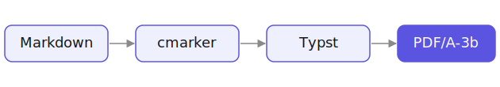

Dieses Dokument ist zugleich **Vorlage**, **Schaustück** und **Falltest**: Es ist mit genau
der Pipeline gesetzt, die es beschreibt, und deckt jedes unterstützte Element mindestens
einmal ab.[^pipeline] Wer eigene Dokumente schreibt, findet hier eine vollständige Referenz
dessen, was Markdown im Alltag hergibt — und wie es im fertigen PDF aussieht.

Die Idee dahinter ist schlicht: Inhalt gehört in reinen Text, die Form ins Template. Dieselbe
Quelle ergibt so immer dasselbe, einheitlich gestaltete Ergebnis — **ohne Textverarbeitung,
ohne manuelles Layout**. Zusätzlich trägt jedes erzeugte PDF seine eigene Markdown-Quelle als
Anhang in sich und bleibt damit jederzeit verlustfrei in Text rückführbar.[^attach]

[^pipeline]: Der Ablauf in einem Satz: Markdown → Typst (Package *cmarker*) → PDF/A-3b.
    Fußnoten fluchten am unteren Seitenrand mit hängendem Einzug.

[^attach]: Herauslösen z. B. mit `mutool extract datei.pdf`.

# Überblick

Wer Inhalt schreibt, soll sich nicht um Ränder, Schriften oder Kopfzeilen kümmern müssen. Die
Pipeline verfolgt drei Ziele, die sich im ganzen Dokument wiederfinden.

## Reproduzierbare Gestaltung

Dieselbe Quelle ergibt immer dasselbe Layout. Schriften, Ränder und Farben liegen zentral im
Template; die Quelle enthält ausschließlich Inhalt und einen optionalen Frontmatter für die
wenigen dokumentweiten Schalter.

## Langzeitarchivierung

Das Ergebnis ist *PDF/A-3b*, ein ISO-Standard für die dauerhafte Ablage. Schriften sind
eingebettet, Farben definiert, und die Markdown-Quelle liegt als Dateianhang bei.

## Minimale Quelldateien

Eine `.md`, sonst nichts — Bilder und ein optionales Logo ausgenommen. Genau das macht die
Quelle diff-bar, versionierbar und für Menschen wie Maschinen gleichermaßen lesbar.

# Text & Auszeichnung

Im Fließtext funktionieren *kursiv*, **fett**, ***beides***, `inline-code`, ~~durchgestrichen~~
sowie [externe Verweise](https://typst.app) ohne jeden Zusatzaufwand. Längere Absätze werden im
**Blocksatz mit Silbentrennung** gesetzt, sodass der rechte Rand ruhig bleibt und der Grauwert
der Seite gleichmäßig wirkt — auch über mehrere Zeilen hinweg und mit eingestreuten
Fachbegriffen wie `PDF/A`, `sys.inputs` oder `--font-path`.

Absätze werden durch eine Leerzeile getrennt. Ein einzelner Zeilenumbruch in der Quelle wird zu
einem Leerzeichen; das hält den Quelltext angenehm schmal, ohne die Ausgabe zu beeinflussen.[^umbruch]

[^umbruch]: Zwei Leerzeichen am Zeilenende erzwingen bei Bedarf einen harten Umbruch.

# Listen

## Geordnet & verschachtelt

Nummerierte und verschachtelte Listen werden sauber gesetzt und korrekt eingerückt:

1. Quelle in Markdown schreiben.
2. Optional einen Frontmatter ergänzen:
   - `date` für ein Datum in der Fußzeile,
   - `toc` für das Inhaltsverzeichnis,
   - `h1-break` für den Kapitelumbruch,
     - und tiefere Ebenen behalten denselben Marker.
3. Bauen lassen — fertig.

## Aufgabenlisten

Checklisten werden erkannt; die Kästchen ersetzen den Listenpunkt (☐ offen, ☒ erledigt), statt
doppelt zu erscheinen:

- [x] Konzept festgelegt

- [x] Pipeline umgesetzt

- [ ] Letzter Feinschliff am Layout

## Gemischte Listen

Normale Punkte und Aufgaben dürfen sich in einer Liste mischen — die Punkte behalten ihr
Quadrat, die Aufgaben zeigen nur das Kästchen:

- Ein normaler Aufzählungspunkt
- [x] Eine erledigte Aufgabe
- [ ] Eine offene Aufgabe

# Tabellen

Tabellen folgen der gewohnten Pipe-Syntax und werden über die volle Breite gesetzt — Kopfzeile
zentriert und fett, Inhalte linksbündig, mit leichtem Zeilen-Zebra und dünnen Linien.

| Element       | Schrift         | Beispiel        |
| ------------- | --------------- | --------------- |
| Fließtext     | Source Sans 3   | dieser Absatz   |
| Überschriften | Source Serif 4  | „Tabellen"      |
| Code          | Source Code Pro | `print("hi")`   |
| Zahlenwert    | linksbündig     | 1.234,56 €      |

## Zweite Tabelle

Auch mehr Spalten und kurze Werte bleiben lesbar:

| Kürzel | Bedeutung          | Default | Bereich   |
| ------ | ------------------ | ------- | --------- |
| `toc`  | Inhaltsverzeichnis | auto    | an/aus    |
| `date` | Fußzeilen-Datum    | leer    | ISO-Datum |
| `lang` | Sprache            | `de`    | `de`/`en` |

# Abbildungen

Ein lokales Bild wird als nummerierte *Abbildung* mit Untertitel gesetzt; relative Pfade lösen
sich gegen das Dokumentverzeichnis auf:



Bilder mit **Remote-Adresse** (`http(s)://`) lassen sich offline nicht laden — Typst hat bewusst
keinen Netzzugriff — und werden automatisch entfernt; der Build meldet, wie viele Bilder er
übersprungen hat:

[](https://typst.app)

# Definitionslisten

Begriff und Erläuterung stehen als Definitionsliste — der Begriff fett, die Erläuterung
eingerückt:

PDF/A-3b
: Archivformat mit erlaubten Dateianhängen — hier die Markdown-Quelle. Erlaubt Inline-Auszeichnung
  wie `code` in der Beschreibung.

Variable Schrift
: Eine Schriftdatei, die über eine Achse (`wght`) beliebige Strichstärken liefert — Grundlage der
  halbfetten Überschriften.

# Code & Technisches

Codeblöcke erhalten Syntax-Hervorhebung. Ein kurzes Python-Beispiel:

```python
from pathlib import Path

def render(src: Path) -> Path:
    """Markdown -> PDF/A; gibt den Ausgabepfad zurück."""
    out = src.with_suffix(".pdf")
    print(f"{src} -> {out}")
    return out
```

Und der Aufruf der Pipeline selbst:

```bash
rf-document dokument.md      # -> dokument.pdf neben der Quelle
```

> **Hinweis:** Voraussetzung ist Typst ≥ 0.15. Erst diese Version rendert die gebündelten
> variablen Schriften, aus deren `wght`-Achse der halbfette Schnitt der Überschriften stammt.

# Mathematik

Formeln werden ohne zusätzliche Schrift gesetzt — inline wie $E = mc^2$ oder abgesetzt:

$$
\int_{a}^{b} f(x)\,\mathrm{d}x = F(b) - F(a)
$$

Auch Brüche, Indizes und Summen sind möglich:

$$
\sum_{i=1}^{n} i = \frac{n\,(n+1)}{2}
$$

# Struktur & Layout

Die Ebenen haben feste Rollen:

- Der **Titel** kommt aus dem Frontmatter (`title:`) — zentriert oben, zusätzlich in der Kopfzeile
  ab Seite 1. Er ist kein Heading und erscheint nicht im Inhaltsverzeichnis; der PDF-Metadatentitel
  entspricht `title:` (ersatzweise dem Dateinamen).
- **H1** ist ein **Kapitel**: trägt eine feine Linie, beginnt bei `h1-break` auf einer neuen Seite
  und läuft oben im Seitenkopf mit — sofern kein fester `header` gesetzt ist.
- **H2** und **H3** sind Unterabschnitte; ab **H4** wird nur noch fett und linksbündig gesetzt.

#### Ein H4-Unterabschnitt

Die vierte Ebene erscheint nur noch fett und linksbündig — ohne eigene Größe oder Linie.

Ab mehr als fünf H1-/H2-Überschriften schaltet das Dokument automatisch in den strukturierten
Modus (Inhaltsverzeichnis voran, jedes Kapitel auf neuer Seite) — hier zusätzlich per Frontmatter
erzwungen. Ist ein `date` gesetzt, erhält die Ausgabedatei einen ISO-Präfix
(`2026-07-01_example.pdf`) und das Datum erscheint rechts in der Fußzeile.

# Sonderzeichen & Emoji

Normaler Text bleibt **Source Sans 3**; nur Zeichen, die Source nicht kennt, fallen pro Glyph
monochrom auf **Noto Emoji** und **Noto Sans Symbols 2** zurück — PDF/A-3b-konform. Dass dieser
Abschnitt fehlerfrei baut, belegt den Fallback:

- Objekte und Status: 🚀 📊 📝 🔑 🔍 📌 ☑ ✗ ⚠ 💡 ◎ 🔒.
- Gesten und Natur: ☺ 👍 👎 👀 🥽 ✿ ⚡ ❄ ☾ ☆ 🔥 🌱.
- Pfeile: → ← ↑ ↓ ⇒ ⇐ ⇔ ➤ —.
- Häkchen und Marker: ✓ ✔ ✗ ✘ ☑ ☐ ★ ☆ • ▪ ▸.
- Mathe und Technik: ± × ÷ ≤ ≥ ≠ ≈ ∞ √ ∫ ∑ ∂ ∈ ⊆ ½ m² H₂O CO₂.
- Währung und Recht: € £ ¥ $ ₿ № § ¶ © ® ™ ‰.
- Geometrie und Spiel: ■ □ ▲ △ ● ○ ♦ ◇ ♠ ♥ ♦ ♣ ♛ ♞.

---

Damit ist der Rundgang abgeschlossen: eine einzige Markdown-Quelle, ein archivfähiges PDF, die
Quelle inklusive — und ein Wasserzeichen, das dieses Dokument als *Beispiel* ausweist.
